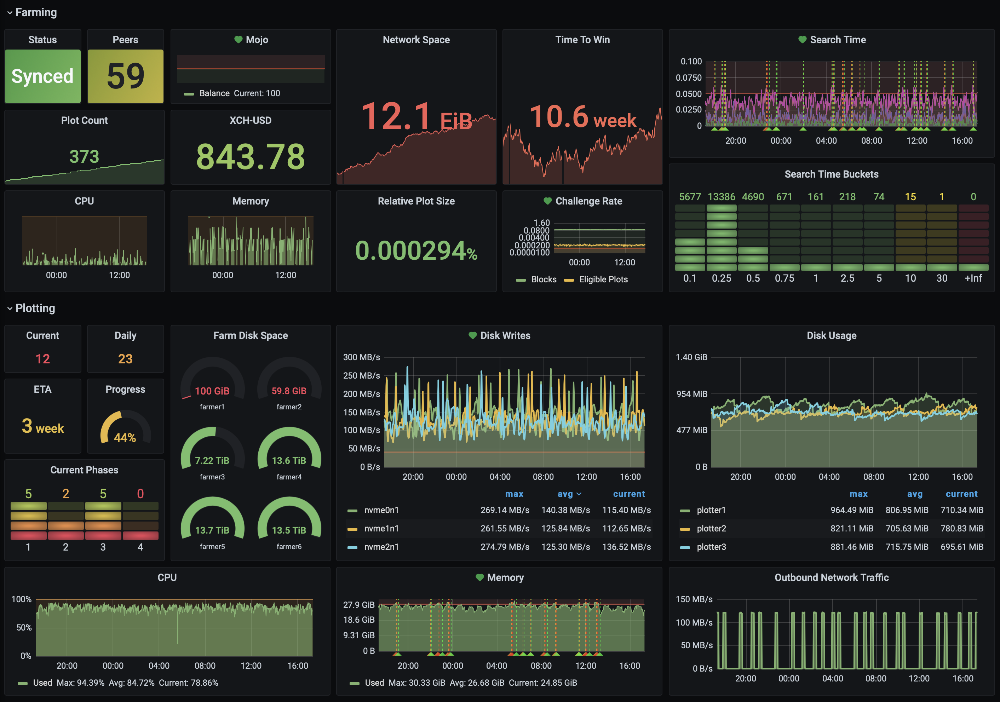

# chia-dashboard
Grafana dashboard for [Chia Network](https://www.chia.net).

## Installation

### Chia Exporters

There are 2 different components to exporting data from Chia:

* a custom [HTTP server](https://github.com/7AC/chia-blockchain/blob/main/chia/server/start_http_server.py) and [exporter](https://github.com/7AC/chia-blockchain/blob/main/chia/server/start_exporter.py) to export farming data
* [chia_exporter](https://github.com/retzkek/chia_exporter) to export data available via the RPC API

### Coinmarketcap

Install [coinmarketcap-exporter](https://github.com/7AC/coinmarketcap-exporter).

### Plotman

Install this custom [plotman exporter](https://github.com/7AC/plotman/blob/main/src/exporter.py).

### mtail

Install [mtail](https://github.com/google/mtail) on the farmer and add [chialog.mtail](https://github.com/retzkek/chiamon/blob/master/mtail/chialog.mtail).

### SNMP exporter (optional)

If you're using a QNAP NAS for farming you can use this [SNMP exporter](https://github.com/sandrotosi/qnap-dashboards).

### Prometheus

Install [Prometheus](https://prometheus.io/download/#prometheus) and [Node Exporter](https://prometheus.io/docs/guides/node-exporter/). Use `prometheus.yml` to configure (replace `localhost`, `plotter`, `farmer` and the IPs in there appropriately).

### Grafana

Install [Grafana](https://grafana.com/grafana/download?pg=get&plcmt=selfmanaged-box1-cta1) and add the dashboard in `grafana.json`. Customize the various panels with the appropriate devices, mountpoints etc.

## Open Issues

I'd like to eventually generalize enough all the "custom" items above that come from [github.com/7AC](https://github.com/7AC) so they can be rolled back into their respective repos. Also all the files in this repo require editing (addresses, mountpoints, etc).
